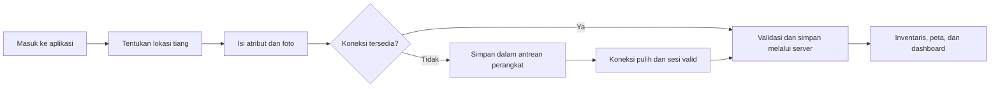
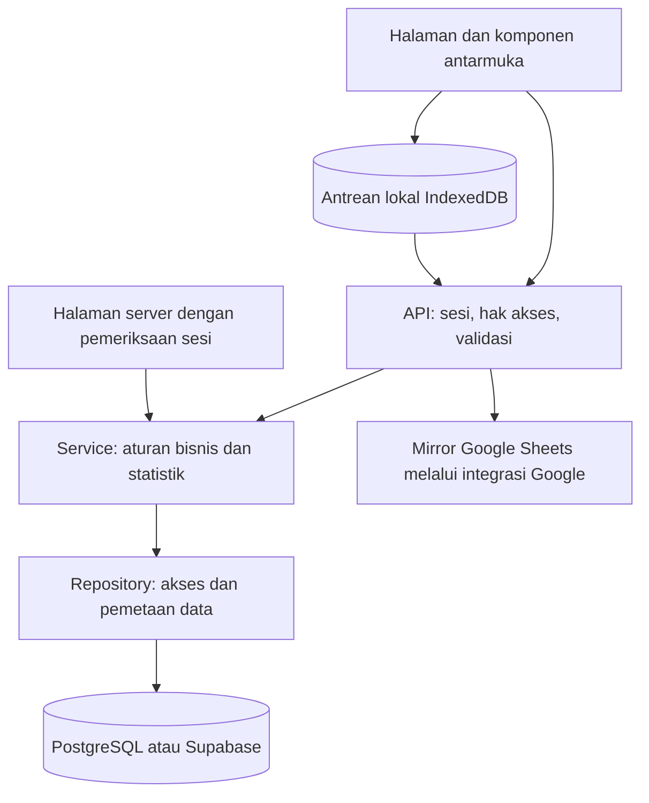

<div align="center">

# Infra-Map

### Infrastructure Mapping System

**Pendataan dan pemetaan infrastruktur Kota Lubuklinggau**

Survei lapangan · Inventaris aset · Peta jaringan · Pemantauan kondisi

</div>

---

Infra-Map adalah aplikasi Web GIS yang menghubungkan hasil survei lapangan dengan
inventaris infrastruktur berbasis lokasi. Setiap titik memiliki informasi posisi,
kategori, provider atau instansi, kondisi fisik, foto, serta identitas petugas survei.
Hubungan antartitik dicatat sebagai segmen jaringan dan dapat dilihat bersama pada peta.

Sistem mencakup tiang jaringan FO/WiFi, penerangan jalan umum (PJU), tiang PLN yang
juga digunakan untuk PJU, dan tiang PLN murni. Data yang sama menjadi dasar daftar
inventaris, peta, ringkasan dashboard, serta ekspor spasial.

> **Ruang lingkup dokumentasi**
>
> Penjelasan ini menggambarkan perilaku dan struktur kode dalam repository.
> Ketersediaan integrasi dan status aktivasi di server mengikuti konfigurasi
> lingkungan. Panduan aktivasi keamanan tersedia di [dokumentasi keamanan](docs/SECURITY.md).

## Jelajahi dokumentasi

| Memahami aplikasi                                 | Memahami sistem                                     |
| ------------------------------------------------- | --------------------------------------------------- |
| [Tujuan dan cakupan](#tujuan-dan-cakupan)         | [Arsitektur aplikasi](#arsitektur-aplikasi)         |
| [Pengguna dan hak akses](#pengguna-dan-hak-akses) | [Model data dan hubungan](#model-data-dan-hubungan) |
| [Alur survei](#alur-survei)                       | [Integrasi layanan](#integrasi-layanan)             |
| [Halaman dan fitur](#halaman-dan-fitur)           | [Struktur repository](#struktur-repository)         |
| [Cara membaca data](#cara-membaca-data)           | [Referensi teknis](#referensi-teknis)               |
| [Survei offline](#survei-offline)                 | [Batasan operasional](#batasan-operasional)         |

## Tujuan dan cakupan

Infra-Map membantu menyatukan pencatatan lapangan sehingga lokasi aset, atribut,
dan bukti dokumentasinya dapat ditelusuri dalam satu aplikasi. Peta menunjukkan
persebaran infrastruktur, daftar inventaris membantu penelusuran detail, dan
dashboard merangkum data untuk melihat kondisi wilayah secara menyeluruh.

| Kategori             | Kode data        | Informasi yang dicatat                                              |
| -------------------- | ---------------- | ------------------------------------------------------------------- |
| Jaringan FO/WiFi     | `FO_WIFI`        | Tiang provider jaringan, material, kondisi, serta pemasangan kabel. |
| PJU mandiri          | `PJU_MANDIRI`    | Tiang penerangan jalan beserta jenis, daya, dan kondisi lampu.      |
| Gabungan PLN dan PJU | `GABUNG_PLN_PJU` | Tiang PLN yang juga digunakan untuk penerangan jalan.               |
| PLN murni            | `PLN_MURNI`      | Tiang distribusi listrik dalam inventaris infrastruktur.            |

Atribut tambahan mencakup kepemilikan, keberadaan kWh meter, kabel jaringan yang
menumpang, dan penanda kondisi berisiko. Kelengkapan atribut mengikuti kategori
serta informasi yang tersedia saat survei.

## Pengguna dan hak akses

Akun memiliki peran, identitas instansi, serta tim KOMINFO atau BAPENDA.
Identitas akun digunakan untuk atribusi survei dan penentuan akses oleh server.

| Peran                       | Cakupan                                                                                                                  |
| --------------------------- | ------------------------------------------------------------------------------------------------------------------------ |
| Petugas (`SURVEYOR`)        | Melihat inventaris, melakukan survei, dan mengedit data survei bersama setelah login.                                    |
| Admin (`ADMIN_KOMINFO`)     | Mengakses inventaris dan tindakan administratif, seperti pengelolaan wilayah, penghapusan massal, dan sinkronisasi data. |
| Super admin (`SUPER_ADMIN`) | Memiliki akses administratif yang dikenali oleh pemeriksaan peran server.                                                |

**Data survei merupakan inventaris bersama.** Petugas dapat mengedit data yang
dibuat petugas lain. Identitas pembuat tetap berasal dari sesi saat pembuatan dan
tidak dapat diganti melalui payload penyuntingan. Hak melihat posisi petugas
mengikuti peran dan tim akun yang tersimpan pada server.

Login menerima email, nomor telepon, atau alias akun yang didukung. Sesi diverifikasi
oleh server melalui cookie; data profil yang disimpan browser bukan dasar hak akses
API. Profil menyediakan perubahan identitas tampilan dan password. Perubahan password
mengakhiri sesi perangkat lain tanpa menghapus draf survei di perangkat tersebut.

## Alur survei



1. **Masuk dengan akun petugas.** Server memverifikasi akun dan menyiapkan sesi.
2. **Tentukan posisi aset.** Gunakan posisi GPS perangkat atau sesuaikan pin pada peta.
   Posisi tiang dan posisi perangkat dicatat sebagai dua informasi terpisah.
3. **Lengkapi atribut.** Pilih kategori, provider atau instansi, wilayah, material,
   kondisi, dan informasi tambahan yang relevan.
4. **Tambahkan dokumentasi.** Foto dan catatan membantu menjelaskan keadaan aset
   serta patokan lokasinya.
5. **Simpan survei.** Permintaan daring melewati pemeriksaan sesi dan validasi data.
   Survei offline disimpan dahulu pada perangkat untuk dikirim saat memungkinkan.
6. **Tinjau hasilnya.** Data tersimpan dapat dibuka pada detail, disunting melalui
   inventaris, ditampilkan pada peta, dan digunakan dalam ekspor.

Provider dinormalisasi agar penyebutan instansi konsisten. Pada pembuatan kategori
PLN murni atau gabungan PLN/PJU, kepemilikan kosong atau `SENDIRI` disesuaikan menjadi
`BERSAMA_PLN`. Penyimpanan utama dan pembaruan mirror merupakan proses berbeda;
berhasil menyimpan survei tidak berarti salinan Google Sheets sudah selesai diperbarui.

## Halaman dan fitur

### Ringkasan dan penelusuran

| Halaman          | Alamat        | Peran dalam aplikasi                                                                  |
| ---------------- | ------------- | ------------------------------------------------------------------------------------- |
| Dashboard        | `/`           | Ringkasan jumlah tiang, kondisi, provider, wilayah, dan estimasi panjang jaringan.    |
| Peta GIS         | `/map`        | Persebaran titik, filter infrastruktur, jalur jaringan, dan alat penelusuran spasial. |
| Inventaris tiang | `/poles`      | Daftar aset dengan pencarian dan filter untuk menemukan data yang diperlukan.         |
| Detail tiang     | `/poles/[id]` | Atribut satu aset, posisi, dokumentasi, dan informasi surveinya.                      |
| Segmen jaringan  | `/segments`   | Hubungan antartitik beserta atribut jalur kabel.                                      |
| Provider         | `/providers`  | Ringkasan inventaris berdasarkan penyedia jaringan atau instansi.                     |

### Survei dan pengelolaan

| Halaman        | Alamat             | Peran dalam aplikasi                                                      |
| -------------- | ------------------ | ------------------------------------------------------------------------- |
| Survei baru    | `/poles/new`       | Formulir pendataan lokasi, kategori, kondisi, wilayah, dan foto aset.     |
| Edit tiang     | `/poles/[id]/edit` | Memperbarui atribut aset yang sudah tercatat.                             |
| Portal petugas | `/surveyor`        | Informasi dan aktivitas petugas survei sesuai akses akun.                 |
| Wilayah        | `/districts`       | Master kelurahan dan kecamatan yang digunakan dalam pendataan.            |
| Administrasi   | `/admin`           | Ringkasan administrasi, sumber data, dan akses pengelolaan yang tersedia. |

### Akun dan pendukung

| Halaman          | Alamat     | Peran dalam aplikasi                                                                             |
| ---------------- | ---------- | ------------------------------------------------------------------------------------------------ |
| Login            | `/login`   | Verifikasi akun sebelum mengakses data aplikasi.                                                 |
| Profil           | `/profile` | Identitas petugas, perubahan profil/password, serta preferensi tampilan.                         |
| Tampilan seluler | `/mobile`  | Tampilan yang ditujukan untuk penggunaan perangkat seluler.                                      |
| Asisten GIS      | `/ai`      | Percakapan pendukung melalui integrasi layanan AI ketika dikonfigurasi dan diizinkan lingkungan. |

`[id]` mewakili identitas record yang dipilih. Navigasi mengikuti konteks pengguna
dan mode layar; keberadaan sebuah halaman tidak memberikan hak administratif
kepada akun yang membukanya.

## Cara membaca data

### Identitas, posisi, dan wilayah

- **ID tiang** adalah identitas record. **Kode fisik** (`poleCode`) merupakan label
  tiang di lapangan; keduanya tidak selalu sama.
- **Koordinat tiang** adalah posisi aset yang ditetapkan melalui pin. **Koordinat
  perangkat** adalah posisi GPS saat survei, jika tersedia.
- **Akurasi GPS** menjelaskan ketelitian pembacaan perangkat. **Jarak perangkat ke
  pin** membantu memeriksa apakah posisi yang dipilih masuk akal.
- **Kelurahan, kecamatan, jalan, dan patokan** memberi konteks administratif serta
  petunjuk untuk menemukan kembali aset.

Perhitungan jarak menggunakan Haversine. Pemeriksaan kualitas lokasi memberikan
peringatan ketika jarak melampaui 50 meter dan tingkat berlebih ketika melampaui
100 meter. Indikator tersebut membantu peninjauan; kondisi GPS dan situasi lapangan
tetap perlu diperhatikan.

### Kondisi dan status pencatatan

| Kelompok                    | Nilai                                                 | Makna                                               |
| --------------------------- | ----------------------------------------------------- | --------------------------------------------------- |
| Kondisi fisik               | `GOOD`, `NEEDS_REPAIR`, `DAMAGED`, `UNKNOWN`          | Baik, perlu perbaikan, rusak, atau belum diketahui. |
| Status validasi             | `DRAFT`, `SUBMITTED`, `VERIFIED`, `REJECTED`          | Tahap pencatatan atau peninjauan record.            |
| Material                    | `BETON`, `BESI`, `KAYU`, `LAINNYA`, `TIDAK_DIKETAHUI` | Bahan utama tiang.                                  |
| Metode lokasi               | `MANUAL_MAP_PIN`, `GPS_DEVICE`, `IMPORT_DATA`         | Cara posisi aset diperoleh.                         |
| Pemasangan kabel pada tiang | `UDARA`, `BAWAH_TANAH`, `TRANSISI_RISER`              | Bentuk pemasangan kabel yang dicatat.               |

Kondisi fisik dan status validasi adalah dua atribut berbeda. Record berstatus
`SUBMITTED` belum berarti asetnya rusak atau sudah diverifikasi. Penanda tambahan
mencatat tiang miring, kabel semrawut/rendah, korosi, gangguan ruang jalan, dan potensi
bahaya. Daftar status mendeskripsikan model data, bukan jaminan tersedianya proses
persetujuan terpisah untuk setiap tahap.

### Jaringan dan ringkasan

Satu segmen menghubungkan titik awal (`fromNodeId`) dengan titik akhir (`toNodeId`).
Segmen menyimpan provider, jenis jaringan, cara pemasangan, status, dan estimasi jarak.
Segmen memiliki identitas sendiri, terpisah dari kedua tiang yang dihubungkannya.

Dashboard menggabungkan data tiang, provider, dan segmen. Perhitungan survei harian
menggunakan zona waktu `Asia/Jakarta`. Panjang jaringan yang dihitung secara spasial
adalah estimasi; nilainya tidak menggantikan pengukuran kabel fisik di lapangan.

Ekspor tersedia dalam **CSV**, **KML**, dan **GeoJSON** untuk tabulasi maupun
pengolahan GIS lanjutan. Nilai teks CSV yang berpotensi dibaca sebagai formula
spreadsheet diberi perlindungan saat diekspor.

## Survei offline

Draf tertunda disimpan pada IndexedDB perangkat. Setiap item memuat payload survei,
foto lokal bila tersedia, identitas draf, status pengiriman, dan informasi percobaan
ulang. Identitas yang sama digunakan ketika pengiriman diulang untuk membantu
mencegah duplikasi record.

| Keadaan                          | Perilaku                                                       |
| -------------------------------- | -------------------------------------------------------------- |
| Koneksi terputus                 | Draf tetap berada dalam antrean perangkat.                     |
| Sesi berakhir                    | Sinkronisasi meminta login kembali dan mempertahankan draf.    |
| Akun lain masuk                  | Sinkronisasi memeriksa pemilik draf sebelum memproses antrean. |
| Server mengonfirmasi penyimpanan | Item yang berhasil dikirim dihapus dari antrean.               |
| Pengiriman gagal                 | Item dipertahankan agar dapat dicoba kembali.                  |

Service worker menyimpan formulir survei baru dan aset statis yang diperlukan.
Respons API dan halaman inventaris tidak disimpan dalam cache navigasi tersebut.
Ketersediaan offline tetap bergantung pada aset yang sudah termuat; tile peta,
Street View, pencarian alamat, dan asisten daring memerlukan jaringan.

**Draf lokal belum menjadi cadangan server.** Menghapus data situs, berpindah browser,
atau kehilangan perangkat dapat menghilangkan survei yang belum terkirim. Status
antrean perlu diperiksa sebelum pekerjaan dinyatakan selesai.

## Arsitektur aplikasi



| Lapisan              | Tanggung jawab                                                                                     |
| -------------------- | -------------------------------------------------------------------------------------------------- |
| Halaman dan komponen | Menampilkan informasi, menerima input, dan mengelola interaksi peta/formulir.                      |
| Context dan hooks    | Menjaga status akun, mode tampilan, pembaruan inventaris, dan aktivitas petugas.                   |
| API                  | Memverifikasi sesi, membatasi tindakan sesuai peran, memvalidasi permintaan, dan menyusun respons. |
| Service              | Menjalankan normalisasi provider, aturan data tiang, perhitungan, dan statistik.                   |
| Repository           | Membaca/menulis penyimpanan dan mengonversi nama field API dengan kolom database.                  |
| Integrasi            | Menghubungkan aplikasi dengan foto, spreadsheet, alamat, rute, dan layanan pendukung.              |

### Penyimpanan utama dan salinan

Koneksi PostgreSQL dipilih dari `DATABASE_URL`, `POSTGRES_URL`, `POSTGRESQL_URL`,
atau `PG_CONNECTION_STRING`, sesuai urutan tersebut. Tanpa konfigurasi PostgreSQL,
akses data menggunakan Supabase dengan kredensial khusus server.

Repository inventaris juga memiliki jalur pembacaan cadangan melalui Supabase dan
Google ketika sumber sebelumnya gagal. Hasil kosong yang valid pada sumber utama
tidak memicu pengambilan inventaris lama dari mirror. Perilaku fallback berbeda
antaroperasi; salinan tidak boleh dianggap selalu identik dengan database utama.

Nama beberapa file dipertahankan dari arsitektur sebelumnya. `SupabasePoleRepository`
juga melayani PostgreSQL; factory provider dan segmen berada dalam file bernama
`GoogleSheets…Repository`, meskipun jalur aktifnya mendukung PostgreSQL/Supabase.
Adapter lama dan mock tersedia dalam source, tetapi konfigurasi kosong tidak otomatis
memilih database mock.

### Pembaruan tampilan

Inventaris menggunakan polling API sekitar setiap 20 detik dan event
`gis:hard-refresh`. Hook `useSupabaseRealtimePoles` mempertahankan nama historis;
implementasinya tidak memakai subscription Supabase Realtime. Tampilan dapat
mempertahankan snapshot sebelumnya ketika respons kosong diterima setelah data
pernah terisi.

## Model data dan hubungan

| Entitas               | Tabel                | Hubungan dan isi utama                                                              |
| --------------------- | -------------------- | ----------------------------------------------------------------------------------- |
| Tiang                 | `poles`              | Titik aset beserta kategori, provider, kondisi, wilayah, foto, dan atribusi survei. |
| Provider              | `providers`          | Referensi penyedia atau instansi yang digunakan oleh tiang dan segmen.              |
| Segmen                | `segments`           | Hubungan titik awal/akhir dan karakteristik jaringan kabel.                         |
| Akun                  | `users`              | Identitas, peran, instansi, status akun, dan kredensial autentikasi.                |
| Wilayah               | `subdistricts`       | Referensi kelurahan, kecamatan, kode, dan urutan tampilan.                          |
| Posisi petugas        | `surveyor_locations` | Posisi terbaru, tim, akurasi, dan waktu pembaruan petugas.                          |
| Sesi                  | `auth_sessions`      | Token sesi dalam bentuk hash, akun terkait, dan masa berlaku.                       |
| Pembatasan permintaan | `auth_rate_limits`   | Penghitung bersama untuk membatasi percobaan login dan API tertentu.                |

Objek antarmuka/API menggunakan `camelCase`, sedangkan kolom SQL menggunakan
`snake_case`. Repository menangani konversinya. ID record, kode fisik, nama wilayah,
dan identitas provider mempunyai fungsi berbeda dan tidak saling menggantikan.

Kontrak domain tersedia pada [tipe tiang](src/types/pole.ts),
[tipe segmen](src/types/segment.ts), dan [tipe akun](src/types/auth.ts).
Validasi permintaan tiang merujuk pada [schema Zod](src/lib/validation/poleSchema.ts).
Beberapa atribut menerima string umum pada runtime walaupun tipe domain mencantumkan
pilihan nilai yang lebih spesifik.

## Integrasi layanan

| Layanan                     | Kegunaan                                                       | Ketika layanan tidak tersedia                                       |
| --------------------------- | -------------------------------------------------------------- | ------------------------------------------------------------------- |
| Leaflet dan penyedia tile   | Menampilkan peta dan objek spasial.                            | Peta dasar bergantung pada jaringan dan tile yang tersedia.         |
| Google Maps / Street View   | Referensi lokasi dan tampilan jalan.                           | Tampilan terkait dapat tidak tersedia tanpa key atau akses layanan. |
| LocationIQ / Nominatim      | Mencari alamat dari koordinat.                                 | Alamat dapat tidak lengkap dan perlu dilengkapi manual.             |
| OSRM                        | Referensi rute jalan.                                          | Visualisasi rute bergantung pada respons layanan.                   |
| Google Drive                | Menyimpan foto survei melalui jalur upload yang dikonfigurasi. | Upload dapat beralih ke fallback foto lokal/base64.                 |
| Google Sheets / Apps Script | Mirror data dan integrasi pencatatan.                          | Salinan dapat tertinggal dari penyimpanan utama.                    |
| OpenRouter                  | Layanan percakapan asisten GIS.                                | Fitur memerlukan konfigurasi dan izin lingkungan yang sesuai.       |

Upload foto mencoba Apps Script, kemudian Drive langsung melalui service account,
lalu fallback base64 dengan ID lokal. Respons fallback bukan bukti foto sudah
tersimpan di Google Drive. Apps Script menggunakan POST dengan shared secret dari
server. Mirror CRUD berjalan secara asinkron; full sync menulis ulang sheet tujuan
serta menunggu hasil per kategori.

## Struktur repository

```text
src/
├── app/                 Halaman, layout, dan endpoint API
├── components/          Komponen peta, survei, akun, dan tampilan lainnya
├── config/              Referensi wilayah dan normalisasi provider
├── context/             Status akun dan mode tampilan
├── hooks/               Pembaruan inventaris dan aktivitas petugas
├── lib/
│   ├── gis/             Jarak, alamat, rute, ekspor, dan Street View
│   ├── google/          Adapter Google Sheets, Drive, dan Apps Script
│   ├── offline/         Antrean survei pada perangkat
│   ├── security/        Sesi, password, otorisasi, dan perlindungan input
│   ├── validation/      Schema validasi data
│   └── utils/           Utilitas format, gambar, dan identitas
├── repositories/        Kontrak dan implementasi akses penyimpanan
├── services/            Aturan bisnis, statistik, dan sinkronisasi
└── types/               Definisi data domain
public/                  Aset aplikasi, manifest, dan service worker
supabase/                Schema database dan migrasi SQL
google-apps-script/      Kode integrasi Web App Apps Script
tests/                   Pengujian keamanan terisolasi
scripts/                 Utilitas migrasi, pemeriksaan, dan deployment
docs/                    Dokumentasi pendukung
.github/workflows/       Pemeriksaan otomatis dan deployment
```

Alias `@/` menunjuk ke `src/`. Direktori `.next/`, `node_modules/`, dan arsip rilis
merupakan keluaran proses atau dependensi.

## Referensi teknis

### Teknologi utama

| Bagian                | Teknologi                                                        |
| --------------------- | ---------------------------------------------------------------- |
| Aplikasi dan API      | Next.js 15.5.24 App Router, React 18, TypeScript                 |
| Antarmuka             | Tailwind CSS, Lucide React                                       |
| Pemetaan              | Leaflet dan utilitas GIS internal                                |
| Validasi dan sanitasi | Zod, DOMPurify                                                   |
| Database              | PostgreSQL (`pg`) dan Supabase                                   |
| Operasi offline       | IndexedDB dan service worker                                     |
| Integrasi Google      | Google APIs dan Apps Script                                      |
| Pemeriksaan           | Prettier, TypeScript, Node test runner, PGlite, Gitleaks, CodeQL |
| Rilis                 | GitHub Actions, SSH, Bash, PM2                                   |

Versi dependensi terpasang direkam dalam `package-lock.json`. Konfigurasi contoh
tersedia pada [`.env.local.example`](.env.local.example). Secret database dan
integrasi dibaca dari environment server; variabel `NEXT_PUBLIC_*` dapat terlihat
oleh browser.

<details>
<summary><strong>Kelompok API dan perilaku respons</strong></summary>

API data memerlukan sesi yang valid. Permintaan perubahan data juga diperiksa
asalnya, sementara tindakan administratif membutuhkan peran admin.

| Kelompok             | Endpoint                                                                                         | Fungsi                                                          |
| -------------------- | ------------------------------------------------------------------------------------------------ | --------------------------------------------------------------- |
| Akun                 | `/api/auth/login`, `/api/auth/me`, `/api/auth/logout`, `/api/auth/profile`, `/api/auth/password` | Login, pemeriksaan sesi, logout, profil, dan password.          |
| Inventaris           | `/api/poles`, `/api/poles/[id]`                                                                  | Daftar, pembuatan, detail, penyuntingan, dan penghapusan tiang. |
| Operasi kolektif     | `/api/poles/batch`, `/api/poles/batch-delete`                                                    | Pembuatan koridor dan penghapusan massal.                       |
| Referensi dan ekspor | `/api/poles/codes`, `/api/poles/fix-codes`, `/api/poles/export`                                  | Referensi kode, pemeliharaan kode, dan ekspor data.             |
| Master dan jaringan  | `/api/providers`, `/api/segments`, `/api/districts`                                              | Provider, segmen, dan wilayah.                                  |
| Ringkasan            | `/api/dashboard`                                                                                 | Statistik inventaris.                                           |
| Dokumentasi          | `/api/upload`                                                                                    | Foto multipart dengan field `photo`.                            |
| Petugas              | `/api/surveyors/active`                                                                          | Kehadiran dan posisi petugas sesuai akses.                      |
| GIS                  | `/api/gis/reverse-geocode`, `/api/streetview/photo`                                              | Alamat dan foto jalan.                                          |
| Asisten              | `/api/ai/chat`                                                                                   | Percakapan melalui layanan AI.                                  |
| Sinkronisasi         | `/api/admin/sync-to-sheets`                                                                      | Pembaruan mirror oleh admin.                                    |

Mayoritas respons berbentuk JSON dengan `success`, `data`, `count`, atau `error`.
Ekspor dan foto dapat mengembalikan konten lain. HTTP 401 berarti sesi tidak valid;
403 menunjukkan akses atau asal permintaan ditolak; 429 menunjukkan batas permintaan.

Pencarian tiang menerima `providerId`, `condition`, `kecamatan`, `kelurahan`,
`poleType`, dan `search`. Koordinat `lat`/`lng` mengaktifkan pencarian terdekat:
`radius` 10–500 meter (default 75) dan `limit` 1–100 (default 20). Batas tersebut
bukan pagination umum ketika koordinat tidak diberikan.

</details>

<details>
<summary><strong>Menjalankan dan memverifikasi salinan lokal</strong></summary>

Gunakan Node.js 22, konfigurasi development sendiri, serta database yang sudah
memiliki schema dan akun terhash. Petunjuk migrasi dan aktivasi ada dalam
[panduan keamanan](docs/SECURITY.md). Akun fallback dengan password bawaan tidak
digunakan untuk autentikasi.

```bash
npm ci
# Siapkan .env.local berdasarkan .env.local.example tanpa menimpa konfigurasi yang ada.
npm run dev
```

Aplikasi lokal tersedia di `http://localhost:3000`. Integrasi eksternal tetap
memerlukan konfigurasi masing-masing.

| Perintah                   | Tujuan                                                               |
| -------------------------- | -------------------------------------------------------------------- |
| `npm run check`            | Memeriksa format dan TypeScript.                                     |
| `npm run test:security`    | Menguji handler keamanan dengan database dan IndexedDB terisolasi.   |
| `npm run build`            | Memvalidasi tipe dan membuat build produksi.                         |
| `npm run start`            | Menjalankan build produksi.                                          |
| `npm run security:prepare` | Laporan kesiapan akun; tidak mengubah database tanpa opsi `--apply`. |

Script operasional lama dalam `scripts/` dapat mengakses atau menulis layanan nyata;
nama `test_*` tidak menjamin isolasi. Pengujian terisolasi yang disediakan package
script adalah `test:security`.

</details>

<details>
<summary><strong>Rilis dan aktivasi</strong></summary>

Workflow [Deploy VPS](.github/workflows/deploy-vps.yml) dipicu oleh push ke `main`
atau secara manual. Alurnya memeriksa format, tipe, regresi keamanan, dan audit
dependensi sebelum mengirim source ke VPS. Preflight konfigurasi/database dijalankan
sebelum pengalihan rilis, kemudian Next.js dijalankan melalui PM2.

Environment produksi disimpan terpisah dari arsip source. Pemeriksaan startup
membantu mendeteksi kegagalan rilis, tetapi tidak menggantikan pengujian login,
survei, foto, dan sinkronisasi pada lingkungan tujuan. Migrasi akun, rotasi secret,
dan pembaruan Apps Script mengikuti [panduan aktivasi](docs/SECURITY.md).

Workflow [Security analysis](.github/workflows/security.yml) menyediakan CodeQL dan
pemindaian riwayat Gitleaks. Ketersediaan CodeQL pada repository privat bergantung
pada dukungan GitHub Code Security; required checks dikendalikan pengaturan repository.

</details>

## Batasan operasional

- **Ketepatan lokasi:** GPS, penempatan pin, dan hasil pencarian alamat dapat
  berbeda dari kondisi lapangan. Jarak dan panjang jaringan merupakan estimasi.
- **Konsistensi salinan:** mirror dapat tertinggal; hasil fallback perlu diperhatikan
  ketika penyimpanan utama mengalami gangguan.
- **Pembaruan tampilan:** polling bukan pembaruan seketika. Snapshot kosong setelah
  penghapusan semua data mungkin memerlukan pemuatan ulang untuk pemeriksaan.
- **Ketersediaan offline:** penyimpanan draf tidak membuat seluruh layanan peta dan
  integrasi dapat digunakan tanpa internet.
- **Privasi foto:** link Drive yang sebelumnya dibagikan publik tetap mengikuti
  izin file tersebut. Perlindungan API aplikasi tidak mengubah izin foto lama.
- **Lingkungan demo:** guard Vercel membatasi AI dan mutasi tertentu serta menggunakan
  cutoff data demo. Aturan demo belum seragam pada seluruh endpoint.
- **Status produksi:** perubahan kode dan pengujian lokal tidak otomatis mengaktifkan
  migrasi atau mencabut kredensial lama pada layanan eksternal.

Rincian kontrol, hasil pemeriksaan, dan tindak lanjut operasional tersedia pada
[dokumentasi keamanan](docs/SECURITY.md).
